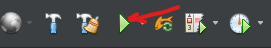

# IoTBay

## About
This project was developed as part of Assigment 1 & 2 for the 41025 Introduction to Software Development course from the University of Technology Sydney. The application was written using Java, using Jakarta EE 10 (formerly Java EE) and Apache Derby 10.10.2.0 database.

## Development Setup

### Prerequisites
- Java Development Kit 17. [Adoptium](https://adoptium.net/en-GB/) JDK 17 is recommended.
- [Apache Derby 10.10.2.0](https://db.apache.org/derby/releases/release-10.10.2.0.html) (this may be updated in the future)
- [Payara Community Server](https://www.payara.fish/downloads/payara-platform-community-edition/) 6.2023.3 (Full) 
- A [Stripe](https://stripe.com/au) account (for payment processing) with a test API key. You will need the test publishable key and test secret key shown in the [Stripe Developers Dashboard](https://dashboard.stripe.com/test/apikeys).
- IDE of your choice. [NetBeans](https://netbeans.apache.org/) and [IntelliJ IDEA](https://www.jetbrains.com/idea/) Ultimate Edition (Ultimate edition is required for Java/Jakarta EE support) are recommended. NetBeans will be used in this guide.

### Setup
1. Clone the repository to your local machine.
2. In the project root directory, create a file called 'secrets.properties' under src/main/webapp/WEB-INF. This file will contain the Stripe API keys and is not tracked by git. The contents of the file should be as follows:
```
stripe.api.key = sk_test_XXXXXXXXXXXXXXXXXXXXXXXX
stripe.api.publishable.key = pk_test_XXXXXXXXXXXXXXXXXXXXXXXX
```
3. Open the project in Apache NetBeans.

4. Configure the project's java SDK in netbeans.

4. Add Payara Server to the project. You may also download Payara server through NetBeans if you do not have it installed.

5. Configure the Payara Server on the project. Set context path/root to '/IoTBay'.

6. Add apache derby server to project and setup database. The database name is 'iotbaydb' and the username and password are both 'iotbay'. Set database location to wherever you want the database to be stored.

7. Clean and build the project. Ensure that the database has been started otherwise the build test will fail.

8. Run the project on the Payara Server. The project should be accessible at http://localhost:8080/IoTBay. NetBeans will automatically open the project in the browser.
<br>

